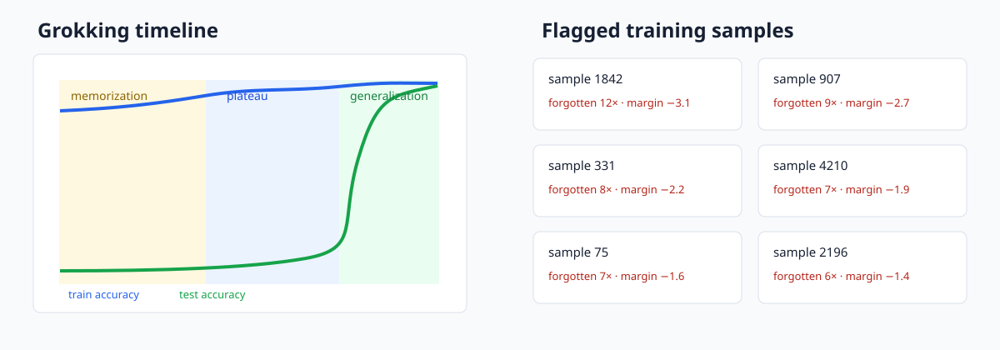

# FlightRec



FlightRec is a black-box flight recorder for PyTorch training runs. It adds explicit calls to an
ordinary training loop, writes crash-safe scalar and per-example traces, and turns them into a
self-contained HTML post-mortem covering learning/forgetting events, automatically detected
training phases, Hessian curvature, influence estimates, and gradient sanity checks.

## Install and integrate

Python 3.10 or newer is required.

```bash
pip3 install -e '.[dev]'
```

The core integration is four lines around the normal loop (call `record_step` after `backward`):

```python
rec = FlightRecorder(model, "runs/exp", num_samples=len(train_data))
loss.backward()
rec.record_step(loss=loss, logits=logits, targets=y, sample_indices=idx)
optimizer.step()
rec.epoch_end()  # after each epoch; call rec.close() when training ends
```

Wrap the source dataset in `IndexedDataset` so batches contain stable sample indices. A recorder is
also a context manager. Scalar JSONL records are appended immediately and flushed each epoch, so an
interrupted run remains readable with `read_run`.

## How it works

Forgetting events count observed transitions from correct to incorrect,
\(F_i=\sum_t 1[c_{i,t-1}=1,c_{i,t}=0]\). Unseen epochs carry the preceding state. FlightRec ranks
samples using forgetting count, late/absent first learning, and low mean margin.

Curvature is never materialized. PyTorch double-backward provides \(Hv\), exposed to SciPy as a
matrix-free operator before Lanczos extracts both algebraic ends of the indefinite Hessian:

```python
op = HessianOperator(model, loss_closure, device="cpu")
low, high = lanczos_spectrum(op, k=10)  # eigsh(..., which="BE")
```

Influence solves \((H+\lambda I)s=g\) by conjugate gradient over that same HVP operator, then scores
\(-g_{test}^{T}s_{train}\), or \(g^Ts\) for self-influence. The last residual block and head are the
default CS1 approximation because full-network inverse-Hessian solves are costly and fragile in a
non-convex network.

Gradient sanity checks compare autograd with central finite differences and, when operations accept
complex inputs, complex-step differentiation
\(f'(x)\approx\operatorname{Im}(f(x+ih))/h\). The latter avoids subtraction and reaches near machine
precision. A separate graph walk finds parameters cut off by `.detach()` or tensor re-wrapping.

All double-backward probes accept an explicit device. Use CPU probes during MPS training; the CS2
script selects that fallback automatically because MPS double-backward coverage is incomplete.

## Reproduce the case studies

CS1 injects uniform wrong-class noise into CIFAR-10 and records correctness against those noisy
training labels. `--subset 5000` is the CPU smoke configuration.

```bash
python3 case_studies/cs1_cifar_label_noise/train.py --subset 5000 --epochs 40 --run-dir runs/cs1-smoke
python3 case_studies/cs1_cifar_label_noise/analyze.py --run-dir runs/cs1-smoke --data-dir data
python3 case_studies/cs1_cifar_label_noise/train.py --epochs 40 --noise-rate .1 --run-dir runs/cs1-full
python3 case_studies/cs1_cifar_label_noise/analyze.py --run-dir runs/cs1-full --data-dir data
```

On a modern 8-core CPU, the subset run is typically a few hours and analysis (5,000 last-block
candidates) up to 20 minutes; the full training run is intended for CUDA and typically takes under
an hour on a recent consumer GPU. Hardware and PyTorch version materially affect these estimates.
The analyzer prints measured metrics and generates `pr_curves.html` plus `report.html`.

| CS1 detector | required average precision | required precision@noise-count |
|---|---:|---:|
| forgetting dynamics, full CIFAR-10 / 40 epochs | > 0.70 | > 0.65 |

CS2 uses every ordered pair for addition modulo 97, a seeded half split, 512-sample batches, and
AdamW weight decay 1.0 (the grokking-critical setting):

```bash
python3 case_studies/cs2_grokking/train.py --p 97 --steps 30000 --run-dir runs/cs2
python3 case_studies/cs2_grokking/analyze.py --run-dir runs/cs2
```

This takes minutes on CUDA and generally under an hour on a modern CPU when spectrum probes are
disabled for a smoke run (`--no-spectrum`). The canonical run saves threshold checkpoints and probes
curvature every 1,000 steps.

| CS2 criterion | expected result |
|---|---|
| train/test separation | train >99% at least 3,000 steps before test >90% |
| automatic transition detection | breakpoint within the 5%–95% test-accuracy window |

## Reports, checks, and overhead

```python
from flightrec.report import build_report

build_report("runs/exp", "runs/exp/report.html")
```

The report embeds Plotly itself and all figures, so the result is a single offline HTML file. Run the
scientific tests and the 200-step overhead measurement with:

```bash
ruff check .
pytest -q
python3 benchmarks/overhead.py --steps 200
```

| recorder mode | 200-step local time | measured overhead |
|---|---:|---:|
| off | 12.072 s | baseline |
| scalar cheap tier | 12.080 s | 0.07% |
| cheap tier + per-example | 12.131 s | 0.49% |

These numbers were measured on the development Apple Silicon CPU with Python 3.13 / PyTorch 2.13.
The benchmark prints local measurements; short CPU runs are noisy, so repeat it on otherwise idle
hardware before comparing systems.

## Limitations

- Per-example correctness and margins currently assume single-label classification logits.
- Hessian probes describe one fixed batch, not the exact full-dataset Hessian.
- Influence functions rely on local quadratic and stationarity assumptions that can be weak around
  non-convex solutions; damping and last-layer restriction change the approximation.
- Exact self-influence performs a conjugate-gradient solve per candidate and should be pre-filtered
  for large datasets.
- The report is self-contained but can be large because Plotly is embedded inline.
