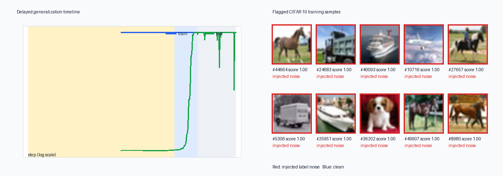

# FlightRec



The gallery shows the five highest-ranked samples overall and, separately, the five highest-ranked
samples that were not artificially corrupted. Blue therefore means “not injected,” not “known to
be correctly labeled”; such samples can still be intrinsically difficult or genuine dataset errors.

FlightRec is a black-box flight recorder for PyTorch training runs. It adds explicit calls to an
ordinary training loop, writes crash-safe scalar and per-example traces, and turns them into a
self-contained HTML post-mortem covering learning/forgetting events, automatically detected
training phases, Hessian curvature, influence estimates, and gradient sanity checks.

## Install and integrate

Python 3.10 or newer is required.

```bash
pip3 install -e '.[dev]'
```

The core integration is four lines around the normal loop (call `record_step` after `backward`):

```python
rec = FlightRecorder(model, "runs/exp", num_samples=len(train_data))
loss.backward()
rec.record_step(loss=loss, logits=logits, targets=y, sample_indices=idx)
optimizer.step()
rec.epoch_end()  # after each epoch; call rec.close() when training ends
```

Wrap the source dataset in `IndexedDataset` so batches contain stable sample indices. A recorder is
also a context manager. Scalar JSONL records are appended immediately and flushed each epoch, so an
interrupted run remains readable with `read_run`.

## How it works

Forgetting events count observed transitions from correct to incorrect,
\(F_i=\sum_t 1[c_{i,t-1}=1,c_{i,t}=0]\). Unseen epochs carry the preceding state. FlightRec ranks
samples using forgetting count, late/absent first learning, and low mean margin.

Curvature is never materialized. PyTorch double-backward provides \(Hv\), exposed to SciPy as a
matrix-free operator before Lanczos extracts both algebraic ends of the indefinite Hessian:

```python
op = HessianOperator(model, loss_closure, device="cpu")
low, high = lanczos_spectrum(op, k=10)  # eigsh(..., which="BE")
```

`lanczos_spectrum` retains converged ARPACK behavior for scientific checks and small probes. For
large-model telemetry, `FlightRecorder(..., spectrum_lanczos_steps=N)` uses exactly `N` matrix-
vector products and records reproducible Ritz estimates from the projected tridiagonal; this keeps
periodic probes bounded and records the approximation budget in run metadata.

Influence solves \((H+\lambda I)s=g\) by conjugate gradient over that same HVP operator, then scores
\(-g_{test}^{T}s_{train}\), or \(g^Ts\) for exact self-influence. CS1 uses the guide's cheaper shared
validation solve over cached final-head features: one inverse-Hessian solve is reused for every
candidate. Exact per-candidate self-influence remains available for smaller problems.

Gradient sanity checks compare autograd with central finite differences and, when operations accept
complex inputs, complex-step differentiation
\(f'(x)\approx\operatorname{Im}(f(x+ih))/h\). The latter avoids subtraction and reaches near machine
precision. A separate graph walk finds parameters cut off by `.detach()` or tensor re-wrapping.
`case_studies/quick_influence_sanity/run.py` runs all three checks against deliberately broken code
in about a second.

All double-backward probes accept an explicit device. Use CPU probes during MPS training; the CS2
script selects that fallback automatically because MPS double-backward coverage is incomplete.

## Reproduce the case studies

CS1 injects uniform wrong-class noise into CIFAR-10 and records correctness against those noisy
training labels. `--subset 5000` is the CPU smoke configuration.

```bash
python3 case_studies/cs1_cifar_label_noise/train.py --subset 5000 --epochs 40 \
  --seed 0 --device cpu --num-workers 0 --run-dir runs/cs1-subset-5000
python3 case_studies/cs1_cifar_label_noise/analyze.py --skip-influence \
  --run-dir runs/cs1-subset-5000 --data-dir data
python3 case_studies/cs1_cifar_label_noise/train.py --epochs 35 --schedule-epochs 40 \
  --noise-rate .1 \
  --seed 0 --device cpu --num-workers 0 --test-batch-size 2048 \
  --run-dir runs/cs1-full-50000-accepted
python3 case_studies/cs1_cifar_label_noise/analyze.py \
  --run-dir runs/cs1-full-50000-accepted --data-dir data --device cpu
```

The measured 5,000-example CPU run completed in 3,874.90 seconds on an Apple M5 and produced a
40×5,000 dynamics array, AP 0.1804, precision@500 0.2020, `pr_curves.html`, and a 5.25 MB
self-contained `report.html`. These subset scores are smoke evidence only; the acceptance thresholds
below apply to the full dataset. The subset command skips influence because the full-data run below
provides the meaningful 5,000-candidate measurement.

The first full 40-epoch run measured AP 0.7260 but precision@noise-count 0.5878 as late
memorization weakened the ranking. Following the specified remedy of tuning training rather than
the metric, the accepted run stops at epoch 35 while retaining the original 40-epoch cosine
horizon. It completed in 20,223.13 seconds on the same CPU, ended at 90.16% test accuracy, and
cleared both gates:

| CS1 detector | required AP | measured AP | required precision@k | measured precision@k |
|---|---:|---:|---:|---:|
| forgetting dynamics, full CIFAR-10 | > 0.70 | 0.8028 | > 0.65 | 0.7000 |
| shared validation influence | reported | 0.4471 | reported | 0.4418 |
| dynamics/influence rank average | reported | 0.7116 | reported | 0.6962 |

The influence analysis scores 5,000 candidates (the top 2,000 dynamics flags plus 3,000 seeded
random examples) in 27.06 seconds on CPU. It caches final-block features, estimates the classifier-
head Hessian from 1,024 examples, and reuses one solve against a fixed 512-example clean validation
batch. `influence_results.npz` stores every candidate index and finite score, and the regenerated
report includes the influence-versus-suspicion scatter. The weaker standalone influence result is
reported as measured rather than hidden; only the forgetting detector has an acceptance threshold.
Examples outside the candidate set receive one tied bottom influence rank, avoiding arbitrary
index-dependent ranks when computing the combined detector.

CS2 uses every ordered pair for addition modulo 97, a seeded half split, and AdamW weight decay
1.0. The following full-batch configuration is the measured CPU acceptance run:

```bash
python3 case_studies/cs2_phase_transition/train.py --p 97 --train-frac .5 --steps 30000 \
  --seed 0 --batch-size 4704 --lr .00075 --device cpu \
  --spectrum-every 1000 --spectrum-k 1 --spectrum-lanczos-steps 20 \
  --run-dir runs/cs2-validated-spectra
python3 case_studies/cs2_phase_transition/analyze.py --run-dir runs/cs2-validated-spectra
```

The fully instrumented run completed in 1,919.33 seconds on an Apple M5 CPU with Python 3.13.9 and
PyTorch 2.13.0. It records a 20-step, `k=1` Lanczos Ritz estimate every 1,000 optimization steps;
all 30 probes are finite and cover steps 1,000 through 30,000. The default mini-batch and learning
rate remain 512 and 0.001 for exploratory runs.

| CS2 criterion | required | measured |
|---|---:|---:|
| train/test separation | at least 3,000 steps | 3,400 steps (100 to 3,500) |
| automatic transition detection | breakpoint inside transition | step 3,137 inside 2,500 to 3,500 |
| curvature coverage | every 1,000 steps | 30/30 finite probes; Ritz range -68.42 to 16,191.45 |

The separate converged one-step full-transformer smoke produced extreme Hessian eigenvalues of
-0.3764 and 0.4579. It validates the exact ARPACK path, while the accepted run above demonstrates
bounded periodic telemetry throughout training and supplies the headline eigenvalue trajectory.

## Quick visual case studies

These deterministic CPU examples exercise the real recorder, probe, and report stack in about a
second each, with no dataset download and no waiting for either full case study. Between them they
demonstrate every headline feature on hardware of any size:

```bash
python3 case_studies/quick_label_noise/run.py --run-dir runs/quick-label-noise
python3 case_studies/quick_curvature/run.py --run-dir runs/quick-curvature
python3 case_studies/quick_influence_sanity/run.py --run-dir runs/quick-influence-sanity
```

| example | measured runtime | measured result | visual outputs |
|---|---:|---|---|
| 2-D label noise | 0.53 s | AP 0.9060; precision@72 0.7639 | `label_noise_map.html`, `report.html` |
| tiny-network curvature | 0.72 s | 12 probes; eigenvalues -0.0686 to 0.7540 | `curvature_timeline.html`, `report.html` |
| influence and gradient audit | 1.00 s | self-influence AP 1.0000; dynamics AP 0.9106 | `gradient_sanity.html`, `report.html` |

The first overlays injected noise and the highest suspicion scores on the learned decision surface.
The second records repeated `k=2` Lanczos probes during 120 full-batch steps and plots loss beside
the smallest and largest Hessian eigenvalues.

The third trains a tiny network on 150 points with 10 flipped labels and then flags them twice
over: exact per-candidate self-influence recovers all ten (precision@10 1.0000), recorded forgetting
dynamics recover eight, and the two independent detectors agree at Spearman 0.6555, which the report
plots directly. The same script audits gradients, catching a custom `autograd.Function` whose
backward drops a factor of two (finite-difference and complex-step errors both 2.3e0) and a model
whose second branch is silently detached (`orphan.weight`, `orphan.bias`), while a correct
implementation passes at complex-step error 0.0e0. All HTML outputs bundle Plotly and open offline.

## Mid-sized case study: corrupted handwritten digits

Between the one-second demonstrations and the multi-hour CIFAR-10 study sits a complete run of the
same workflow at laptop scale. It uses the 8x8 digit images bundled with scikit-learn, so it needs
no download, and it exercises everything at once: injected label noise, per-example dynamics,
periodic curvature probes, phase detection, both mislabel detectors, and an illustrated report.

```bash
python3 case_studies/mid_digits_noise/train.py --run-dir runs/mid-digits
python3 case_studies/mid_digits_noise/analyze.py --run-dir runs/mid-digits
```

Training 60 epochs over 1,437 images with 10% corrupted labels took 25.59 s and analysis 2.57 s on
the development CPU; expect a minute or two on an average laptop. The model reaches 100% accuracy
on the corrupted training labels, so every injected mislabel must be memorized, which is exactly
the regime forgetting statistics are designed to expose:

| detector | average precision | precision@144 |
|---|---:|---:|
| forgetting dynamics | 0.9770 | 0.9375 |
| validation influence | 0.7528 | 0.7083 |
| rank average of both | 0.8691 | 0.8194 |

Chance is 0.1002. Influence scores all 1,437 candidates in about a second through the shared-solve
variant restricted to the classifier head. As in CIFAR-10, combining the detectors lands between them rather
than beating the stronger one; the honest reading is that forgetting dynamics carry most of the
signal and influence is a weaker independent confirmation.

The run also records nine bounded-budget Lanczos probes, whose extreme eigenvalues span -0.8963 to
7.1528 and confirm an indefinite Hessian, and the phase detector segments the run into an early
`fitting` phase followed by `memorization` from step 309 onward, using all five available signals.
`report.html` embeds the flagged-sample gallery with each thumbnail captioned by its corrupted and
true label; among the fifty highest-scoring samples every one is genuinely corrupted.

## Reports, checks, and overhead

```python
from flightrec.report import build_report

build_report("runs/exp", "runs/exp/report.html")
```

The report embeds Plotly itself and all figures, so the result is a single offline HTML file. Run the
scientific tests and the 200-step overhead measurement with:

```bash
ruff check .
pytest -q
python3 benchmarks/overhead.py --steps 200 --repeats 3
```

| recorder mode | median of 3 | fastest of 3 | median overhead |
|---|---:|---:|---:|
| off | 270.548 s | 269.837 s | baseline |
| scalar cheap tier | 272.295 s | 269.798 s | +0.65% |
| cheap tier + per-example | 271.268 s | 270.539 s | +0.27% |

These numbers were measured on the development Apple Silicon CPU with Python 3.13 / PyTorch 2.13.
The benchmark uses the actual CS1 ResNet, batch size 128, and SGD optimizer. Each repeat times all
three modes and rotates which one runs first, because run-to-run spread on this machine (about seven
seconds, or 2.7%) is larger than the effect being measured: the first repeat of every mode was the
slowest, and a single unrepeated pass therefore reported negative overhead for instrumented loops.
Taking the median across repeats leaves both recorder tiers under one percent, an order of magnitude
inside the five-percent requirement. The two instrumented tiers remain within noise of each other,
so their ordering should not be read as meaningful. Per-repeat samples and environment details are
in `benchmarks/results.json`.

## Limitations

- Per-example correctness and margins currently assume single-label classification logits.
- Hessian probes describe one fixed batch, not the exact full-dataset Hessian.
- Influence functions rely on local quadratic and stationarity assumptions that can be weak around
  non-convex solutions; damping and last-layer restriction change the approximation.
- Exact self-influence performs a conjugate-gradient solve per candidate and should be pre-filtered
  for large datasets. Shared validation influence is scalable but is not the same quantity and can
  be a weaker detector, as the CS1 measurements show.
- The report is self-contained but can be large because Plotly is embedded inline.

## Intentional deviations

- Never-learned samples retain a raw forgetting count of zero because they have no learned-to-
  unlearned transition, but suspicion ranking treats them as maximal forgetting evidence. Using the
  literal zero in that rank makes the hardest samples look easiest and empirically defeats the
  full-data noisy-label acceptance test; no labels, fitted weights, or thresholds enter the rank.
- The default change-point penalty retains the specified `3 * n_signals * log(T)` statistical
  scale but divides it by two when passed to `ruptures.KernelCPD`, calibrating that implementation's
  two-sided boundary cost. An explicit user penalty is passed through unchanged.
- Change-point fitting is downsampled to at most 5,000 rows and mapped back to the original step
  grid. This bounds the RBF kernel's quadratic memory cost on 30,000-step runs while preserving
  breakpoint resolution to at worst six steps in the canonical CS2 configuration.
- The accepted CS2 run uses learning rate 0.00075 instead of the guide's fixed 0.001. The documented
  default mini-batch configuration reached only 1,800 steps of separation and missed the transition
  breakpoint; full-batch seeds 1 and 2 at 0.001 reached only 2,700 and 2,300 steps of separation.
  Thus the 3,400-step accepted result is a seed-0 demonstration with a 400-step margin, not evidence
  of seed-robust behavior.
- The CS2 directory and user-facing outputs use the descriptive name `cs2_phase_transition` instead
  of the implementation guide's legacy directory and phenomenon label. This keeps the empirical
  claim precise: the artifacts demonstrate delayed generalization and an automatically detected
  transition, without asserting a unique causal mechanism.
- The accepted CS2 trajectory uses one eigenvalue from each algebraic end and 20-step Ritz estimates
  instead of five converged values per end. At the trained step-1,000 checkpoint, a strict `k=5`
  ARPACK probe exceeded three minutes and would violate the one-hour CPU target. The bounded budget
  completes all 30 checkpoints in a 1,919.33-second run; exact small-problem and initialization
  probes remain separately verified.
- CS1 restricts influence to the classifier head rather than the guide's "final block and head".
  Features from the frozen final block are cached once, so the inverse-Hessian solve runs over the
  5,130 head parameters instead of 8.4 million. This is what brings 5,000 candidates inside the
  20-minute budget; the wider parameter filter remains available through `InfluenceConfig`.
